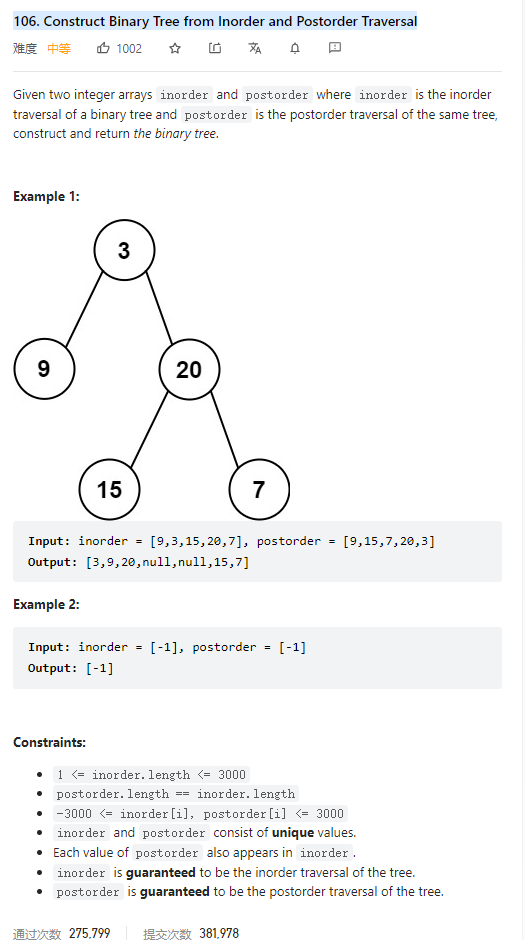

# 106. Construct Binary Tree from Inorder and Postorder Traversal



**Solution:**

### 1. Recursion


- because the postorder's sequence is left, right, middle so the last one would be the middle of the tree
- in this case, 3 is the root
- and from the inorder array, we can see that all integer at left side of 3 is the left subtree and at the right handside is the right subtree
- then, we cut inorder into left half and right half
- after that, cut postorder into left half and right half correspondingly
- the postorder's left half would be the same lenth of inorder left half starting from index 0
- and the its right half would be the remaining array exluding the last int.
- do the recursion:
- and.
- when postorder.length is 0 means this is a null pointer
- when postorder.length is 1 means this is the root needs to be returned.

```java
class Solution {
    public TreeNode buildTree(int[] inorder, int[] postorder) {

        if (postorder.length == 0)
            return null;

        TreeNode root = new TreeNode(postorder[postorder.length - 1]);

        if (postorder.length == 1)
            return root;

        int index = 0;
        while (index < inorder.length) {
            if (inorder[index] == postorder[postorder.length - 1])
                break;
            index++;
        }

        int [] inorderLeft = Arrays.copyOfRange(inorder, 0, index);
        int [] inorderRight = Arrays.copyOfRange(inorder, index+1, inorder.length);

        int[] postorderLeft = Arrays.copyOfRange(postorder, 0, inorderLeft.length);
        int[] postorderRight = Arrays.copyOfRange(postorder,inorderLeft.length , postorder.length-1);

        root.left = buildTree(inorderLeft, postorderLeft);
        root.right = buildTree(inorderRight, postorderRight);
        return root;

    }
}

```
