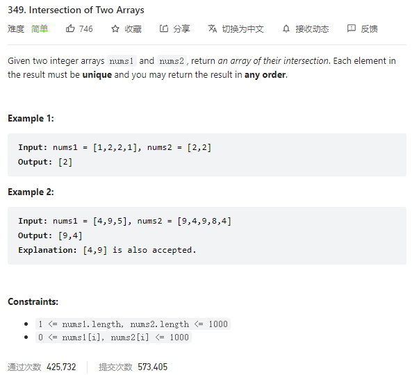

# 349. Intersection of Two Arrays

Given two integer arrays nums1 and nums2, return an array of their intersection. Each element in the result must be unique and you may return the result in any order.



**Solution:**

### 1. HashSet

- first loop put nums1[] into set1 and deduplicate
- second loop check if set1 contains the number in nums2[], if ture then add to the ans set
- then convert the set to an array for output.

```java

class Solution {
    public int[] intersection(int[] nums1, int[] nums2) {
        Set<Integer> set1 = new HashSet();
        Set<Integer> ans = new HashSet();

        for(int i = 0; i < nums1.length; i++) {
            set1.add(nums1[i]);
        }
        for(int i = 0; i < nums2.length; i++) {
            if(set1.contains(nums2[i]))
                ans.add(nums2[i]);
        }
        int[] result = new int[ans.size()];
        int j = 0;
        for(Integer i : ans) {
            result[j] = i;
            j++;
        }
        return result;
    }
}

```

---
