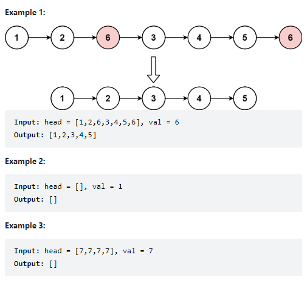

---

Given the head of a linked list and an integer val, remove all the nodes of the linked list that has Node.val == val, and return the new head.



**Solution:**

### 1. Using dummy head

- create a virtual head `dummy` head
- using two pointers `pre` = `dummy` and `cur` = `head`.
- iterate while `cur != null`: if `cur.value` is `target` then `pre.next = cur.next`, else `pre = cur.next`
- then `cur = cur.next`

```java

    public ListNode removeElements(ListNode head, int val) {

        ListNode dummy = new ListNode(0, head);
        ListNode cur = head;
        ListNode pre = dummy;
        while( cur != null )
        {
            if(cur.val == val) {
                pre.next = cur.next;
            } else {
                pre = cur;
            }
            tmp = tmp.next;

        }
        return dummy.next;
    }

```

### 2. Without dummy head

```java

        public ListNode removeElements(ListNode head, int val) {
            while(head != null && head.val == val) head = head.next;

            ListNode cur = head;
            while(cur != null) {
                while(cur.next != null && cur.next.val == val) {
                    cur.next = cur.next.next;
                }
                cur = cur.next;
            }
            return head;
    }

```

---
