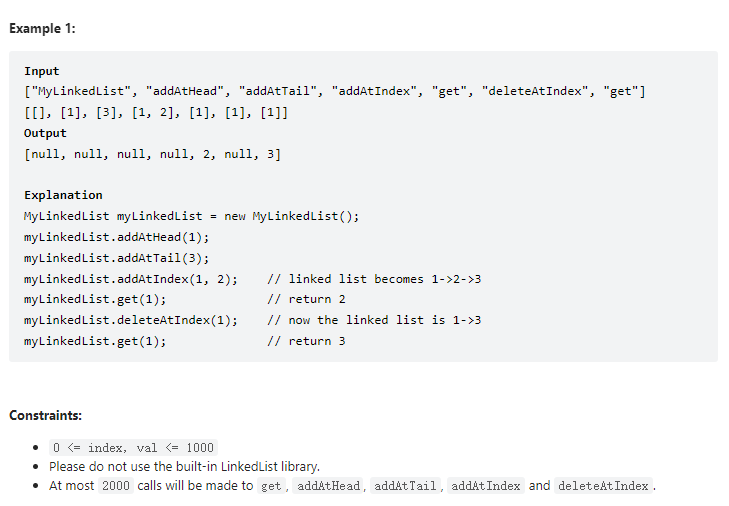

---

Design your implementation of the linked list. You can choose to use a singly or doubly linked list.
A node in a singly linked list should have two attributes: val and next. val is the value of the current node, and next is a pointer/reference to the next node.
If you want to use the doubly linked list, you will need one more attribute prev to indicate the previous node in the linked list. Assume all nodes in the linked list are 0-indexed.

Implement the MyLinkedList class:

MyLinkedList() Initializes the MyLinkedList object.
int get(int index) Get the value of the indexth node in the linked list. If the index is invalid, return -1.
void addAtHead(int val) Add a node of value val before the first element of the linked list. After the insertion, the new node will be the first node of the linked list.
void addAtTail(int val) Append a node of value val as the last element of the linked list.
void addAtIndex(int index, int val) Add a node of value val before the indexth node in the linked list. If index equals the length of the linked list, the node will be appended to the end of the linked list. If index is greater than the length, the node will not be inserted.
void deleteAtIndex(int index) Delete the indexth node in the linked list, if the index is valid.



**Solution:**

### 1. Signle pointer

```java

class MyLinkedList {


    class Node {
        int val;
        Node next;
        Node(){};
        Node(int val) {
            this.val = val;
        }
    }

    int size;
    Node head;

    public MyLinkedList() {
        size = 0;
        head = new Node(0);
    }

    public int get(int index) {
        if(index >= size) return -1;
        Node tmp = head;

        for(int i = 0; i <= index; i++) {
            tmp = tmp.next;
        }
        return tmp.val;

    }

    public void addAtHead(int val) {
        addAtIndex(0, val);
    }

    public void addAtTail(int val) {
        addAtIndex(size,val);
    }

    public void addAtIndex(int index, int val) {
        if(index > size) return;
        if(index < 0) index = 0;
        Node tmp = head;
        Node newNode = new Node(val);
        for(int i = 0; i < index; i++) {
            tmp = tmp.next;
        }
        newNode.next = tmp.next;
        tmp.next = newNode;
        size++;
    }

    public void deleteAtIndex(int index) {
        if(index >= size ) return;
        size--;
        if (index == 0) {
            head = head.next; return;
        }
        Node tmp = head;
        for(int i = 0; i < index; i++) {
            tmp = tmp.next;
        }
        tmp.next = tmp.next.next;
    }
}

/**
 * Your MyLinkedList object will be instantiated and called as such:
 * MyLinkedList obj = new MyLinkedList();
 * int param_1 = obj.get(index);
 * obj.addAtHead(val);
 * obj.addAtTail(val);
 * obj.addAtIndex(index,val);
 * obj.deleteAtIndex(index);
 */

```

### 2. Doublely Linked List

```java

class ListNode{
    int val;
    ListNode next,prev;
    ListNode() {};
    ListNode(int val){
        this.val = val;
    }
}


class MyLinkedList {

    //记录链表中元素的数量
    int size;
    //记录链表的虚拟头结点和尾结点
    ListNode head,tail;

    public MyLinkedList() {
        //初始化操作
        this.size = 0;
        this.head = new ListNode(0);
        this.tail = new ListNode(0);
        //这一步非常关键，否则在加入头结点的操作中会出现null.next的错误！！！
        head.next=tail;
        tail.prev=head;
    }

    public int get(int index) {
        //判断index是否有效
        if(index<0 || index>=size){
            return -1;
        }
        ListNode cur = this.head;
        //判断是哪一边遍历时间更短
        if(index >= size / 2){
            //tail开始
            cur = tail;
            for(int i=0; i< size-index; i++){
                cur = cur.prev;
            }
        }else{
            for(int i=0; i<= index; i++){
                cur = cur.next;
            }
        }
        return cur.val;
    }

    public void addAtHead(int val) {
        //等价于在第0个元素前添加
        addAtIndex(0,val);
    }

    public void addAtTail(int val) {
        //等价于在最后一个元素(null)前添加
        addAtIndex(size,val);
    }

    public void addAtIndex(int index, int val) {
        //index大于链表长度
        if(index>size){
            return;
        }
        //index小于0
        if(index<0){
            index = 0;
        }
        size++;
        //找到前驱
        ListNode pre = this.head;
        for(int i=0; i<index; i++){
            pre = pre.next;
        }
        //新建结点
        ListNode newNode = new ListNode(val);
        newNode.next = pre.next;
        pre.next.prev = newNode;
        newNode.prev = pre;
        pre.next = newNode;

    }

    public void deleteAtIndex(int index) {
        //判断索引是否有效
        if(index<0 || index>=size){
            return;
        }
        //删除操作
        size--;
        ListNode pre = this.head;
        for(int i=0; i<index; i++){
            pre = pre.next;
        }
        pre.next.next.prev = pre;
        pre.next = pre.next.next;
    }
}

/**
 * Your MyLinkedList object will be instantiated and called as such:
 * MyLinkedList obj = new MyLinkedList();
 * int param_1 = obj.get(index);
 * obj.addAtHead(val);
 * obj.addAtTail(val);
 * obj.addAtIndex(index,val);
 * obj.deleteAtIndex(index);
 */

```

---
